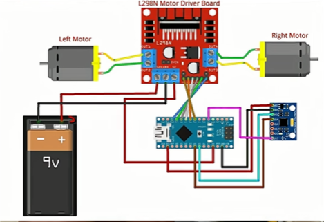

# Self-Balancing-Robot
A two-wheeled self-balancing robot designed to assist in search and rescue operations during disasters such as earthquakes or building collapses. Equipped with an ESP32-CAM for real-time video streaming and IoT dashboard for remote control.
## Features
- Self-balancing control using PID
- MPU6050 Gyroscope + Accelerometer for motion sensing
- Real-time motor control via Arduino Nano
- L298N Motor Driver for bidirectional movement

## Circuit Diagram

## Components Used
- Arduino Nano
- L298N Motor Driver Board
- 2 x DC Motors
- MPU6050 Gyroscope + Accelerometer
- 9V Battery
- Jumper Wires

## Code
The Arduino code is in the [`code/self_balancing_robot.ino`](code/self_balancing_robot.ino) file.

## How it Works
1. The MPU6050 measures pitch, roll, and yaw.
2. PID control algorithm calculates the corrective motor speed.
3. L298N motor driver controls the motors to maintain balance.

## Author
C N Sri Balaji Vara Prasad Mankena
